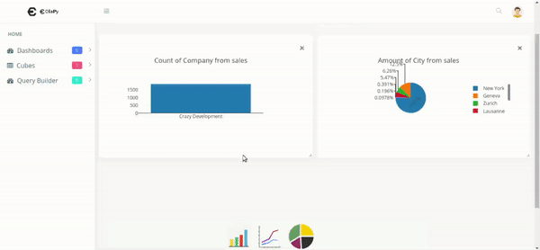

OlaPy, an experimental OLAP engine based on Pandas
==================================================

About
-----

Olapy-web is a visual, web-based tool for exploring and analyzing
OLAP databases served by the `OlaPy <https://github.com/abilian/olapy>`_.

.. image:: docs/img/pvt.gif
   :width: 46%
   :align: right

Status
~~~~~~

This project is currently a research prototype, not suited for production use.

Licence
~~~~~~~

This project is currently licenced under the LGPL v3 licence.

Installation
------------

To set up the application, run, ideally in a virtualenv::

    make develop

(see `make pip`, `make js`, `make build` etc).

Usage
-----

Run the demo
~~~~~~~~~~~~

Run:

1. ``flask init`` to initialize the db and some demos

2. ``make run`` to run application, using the following credential to log in:

  - **login**: admin

  - **password**: admin

3. visit `127.0.0.1:5000`

Developing
----------

This project must adhere to the
`Abilian Developer Guide <http://abilian-developer-guide.readthedocs.io/>`_.

Pull requests are welcome.

Tests
~~~~~

To run tests, run::

    pytest tests

or simply (on Unix-like systems)::

    make test

Documentation
~~~~~~~~~~~~~

See the documentation:
`http://olapy-web.readthedocs.io/en/latest/ <http://olapy-web.readthedocs.io/en/latest/>`_.

To build it, run::

    make doc

and open ``docs/_build/html/index.html``.

Credits
-------

This project is developed by `Abilian SAS <https://www.abilian.com>`_
and partially funded by the French Government through the `Wendelin
<http://www.wendelin.io/>`_ project and the `Investissement d'avenir
<http://www.gouvernement.fr/investissements-d-avenir-cgi>`_ programme.

