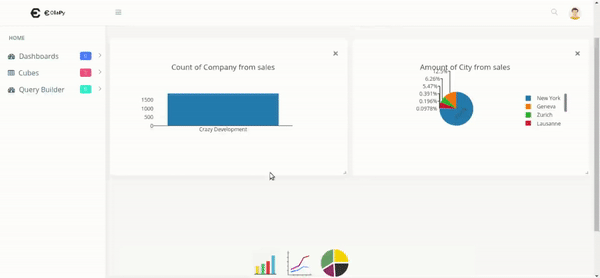
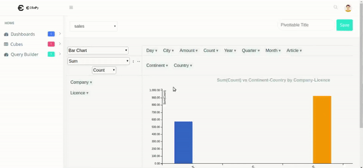

.. Olapy-web documentation master file, created by
   sphinx-quickstart on Tue Nov 21 10:57:54 2017.
   You can adapt this file completely to your liking, but it should at least
   contain the root `toctree` directive.

Welcome to Olapy-web's documentation!
=====================================

Olapy-web is the web client that can be integrated with `Olapy <https://pypi.python.org/pypi/olapy>`_

.. toctree::
   :maxdepth: 2
   :caption: Contents:

   installation
   quick_start
   api

Indices and tables
==================

* :ref:`genindex`
* :ref:`modindex`
* :ref:`search`
